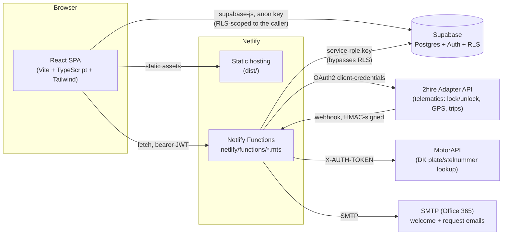

# FLEETii webapp — architecture overview

A living document for onboarding new contributors. Update it alongside the
code as the architecture actually changes — this is a map, not a spec; if it
drifts from reality, fix the map. Danish domain terms (Afdeling, Bruger,
Reservation, etc.) are explained in [CLAUDE.md](../CLAUDE.md), which also has
a running list of non-obvious gotchas worth reading before making changes.

## What this is

A Danish-language fleet/vehicle-reservation admin tool: costumers (companies)
register vehicles fitted with 2hire's telematics hardware, their employees
book/end trips through the app, and admins manage users, departments, and the
fleet. It's a single-page React app backed by Supabase (Postgres + Auth) and
a set of Netlify Functions for anything that needs a privileged key or talks
to an external API.

## System diagram

## Frontend

- **Stack**: React 19 + TypeScript, Vite build, Tailwind CSS v4, React
  Router v7 (client-side routing), Framer Motion (page transitions), Leaflet
  (fleet map). No server-side rendering — plain SPA, `dist/` served as static
  files by Netlify with a catch-all redirect to `index.html`
  ([netlify.toml](../netlify.toml)) so deep links work.
- **Entry point**: [src/App.tsx](../src/App.tsx) declares every route, each
  wrapped in `<ProtectedRoute>` (redirects unauthenticated users to `/`,
  optionally gates by role — see Roles below). `/about` is the one
  deliberately public route.
- **App-wide state via React Context**, not a global store library:
  - [AuthContext](../src/contexts/AuthContext.tsx) — the Supabase Auth
    session plus the app's own `user_profiles` row (role, department,
    costumer). This is the source of truth for "who is logged in" and "are
    they an admin" — pages read it via `useAuth()` rather than querying
    Supabase directly for identity. Also owns the idle-timeout logic and the
    "must change password" / password-recovery redirect.
  - [VehicleContext](../src/contexts/VehicleContext.tsx) — the fleet list and
    live GPS positions, loaded once a user is fully authenticated. The
    *actual* data source (mock fixtures vs. Supabase-backed vs. live 2hire)
    is resolved by `src/lib/vehicleDataSource/`, selected by the
    `VITE_DATA_SOURCE` env var (`mockup-data` / `2hire-test-adaptor` /
    `2hire-production-adaptor`) — the one setting that decides which
    environment both the client *and* the Netlify Functions treat as "real".
- **Pages** (`src/pages/`, ~30 files) are the routed screens;
  **components**  (`src/components/`) are shared building blocks (`PageHeader`, popups,
  glyphs, etc.);
  **hooks** (`src/hooks/`) wrap small pieces of reusable
  stateful logic (lock state, idle-flag popups, ident-column settings).
- **`src/lib/bookings.ts`** deliberately compares reservation timestamps as
  raw ISO string prefixes rather than parsing them into `Date` objects — see
  its own doc comment and CLAUDE.md's gotchas section before touching it.

## Backend: Netlify Functions

Anything that needs a privileged key (Supabase service-role, 2hire client
secret, SMTP credentials, MotorAPI token) or must not be trusted to the
browser lives in [netlify/functions/](../netlify/functions/) — small,
single-purpose `.mts` files, not a general API layer. The client calls them
with `fetch` + its own bearer JWT; each function re-verifies that JWT against
Supabase itself (`_shared/serverAuth.ts`'s `requireUser`/`requireAdmin`)
before doing anything privileged, since the service-role key alone proves
nothing about who's calling.

| Function | Purpose |
| --- | --- |
| `create-user.mts`, `update-user.mts`, `delete-user.mts`, `unblock-user.mts` | User lifecycle (Supabase Auth user + `user_profiles` row + welcome email) |
| `bulk-import-users.mts`, `bulk-import-vehicles.mts` | CSV import flows |
| `switch-department.mts` | "Skift afdeling" — changes which department's data an admin is currently scoped to |
| `complete-password-change.mts` | First-login / recovery password change |
| `2hire-register-vehicle.mts`, `2hire-vehicle-command.mts`, `2hire-vehicle-state.mts`, `2hire-board-profiles.mts`, `2hire-subscribe.mts`, `2hire-webhook.mts` | 2hire integration — see below |
| `set-vehicle-lock.mts` | Sends the real 2hire lock/unlock command *and* persists the resulting state |
| `delete-vehicle.mts`, `delete-costumer.mts`, `send-vehicle-deletion-request.mts`, `send-vehicle-request.mts` | Vehicle/costumer lifecycle + the email-based request flow to FLEETii staff |
| `motorapi-vehicle-lookup.mts` | Danish plate/stelnummer lookup via MotorAPI |
| `seed-test-bookings.mts` | Test-data seeding (non-production tooling) |

`netlify/functions/_shared/` holds the reusable pieces:
`serverAuth.ts` (identity/role checks), `twoHireClient.ts` +
`twoHireCredentials.ts` (2hire HTTP client + per-costumer credential
resolution — see below), `mailer.ts` (SMTP), `userAccount.ts`,
`departmentLookup.ts`, `webhookSignature.ts` (HMAC verification for 2hire's
webhook).

## Database: Supabase

- **Postgres + Auth + Row-Level Security**, one project per environment (see
  Environments below). `user_profiles.role` (`user` / `admin` / `FLEETii
  admin`) plus `department_id`/`costumer_id` are the source of truth for
  authorization; RLS policies scope most tables to "your own department" or
  "your own costumer", with explicit FLEETii-admin-bypass policies where a
  platform-wide view is needed (e.g. `user_profiles_select_allow_fleetii_admin.sql`).
- **`supabase/applied/`** is an incremental migration log (121 files and
  counting) — **not a full schema dump**. Core tables predate this
  convention and only exist in the live databases; see CLAUDE.md for how to
  actually clone a project's schema (`pg_dump --schema-only`, plus manually
  recreating `auth.users` triggers that a public-schema-only dump drops).
- A renamed table keeps its RLS policies but loses its `role_table_grants` —
  a bare "permission denied" after a rename is usually that, not a missing
  policy.

## External integrations

### 2hire (telematics)

The vehicles' hardware/telemetry provider — lock/unlock commands, GPS,
fuel/battery level, trip state. Three separate hosts, picked by
`VITE_DATA_SOURCE`:

| Host | Used for |
| --- | --- |
| `test.adapter.2hire.io` | Auth, vehicle registration, commands, webhook subscription — the default/staging target (`getTwoHireBaseUrl()` in `twoHireClient.ts`) |
| `e2e.adapter.2hire.io` | Device creation + trip simulation for local/test tooling only (`e2e-*` helpers in `twoHireClient.ts`) |
| `adapter.2hire.io` | The real production fleet — only reachable when `VITE_DATA_SOURCE=2hire-production-adaptor` |

**Per-costumer credentials**: each costumer can have its own 2hire
sub-account (`costumers.twohire_client_id`, readable; `twohire_client_secret`,
service-role-only). `resolveTwoHireCredentials()` decides which credential
set an operation uses, always resolved server-side from the actual
vehicle/order being acted on — never trusted from the client: a
FLEETii-admin-initiated action always uses the global `TWOHIRE_CLIENT_ID`/
`SECRET` credential, in every environment ("one master account that can
reach every sub-account too"); otherwise the *target* costumer's own
sub-account credential is used whenever it's actually configured, in every
environment too — this is deliberate, since it's what lets a staging
costumer's own columns be pointed at the test adapter's credential to
exercise this path before touching production. Only when nothing's
configured does it fall back to the global credential — and in production
specifically, that "nothing configured" case is a hard error instead, so a
real costumer can never silently borrow the master credential.

2hire delivers webhook events (`2hire-webhook.mts`), HMAC-signed with
`TWOHIRE_WEBHOOK_SECRET`. That secret is captured by 2hire at
`2hire-subscribe.mts` call time, not read live on every delivery — rotating
the env var alone breaks signature verification until `2hire-subscribe` is
re-run.

### MotorAPI

Danish vehicle-registry lookup by plate/stelnummer
(`motorapi-vehicle-lookup.mts`), used by the "i" info button on
VehicleCreatePage's Nummerplade field. Authenticated via `X-AUTH-TOKEN`.

### SMTP (Office 365 or similar)

Plain SMTP, used for two things: the new-user welcome email
(`create-user.mts`) and the "Send bestilling til FLEETii"
vehicle-request/deletion-request emails. Configured via `SMTP_HOST`/`SMTP_USER`/
`SMTP_PASS` — see `_shared/mailer.ts`.

## Roles & authorization

Three roles, checked both client-side (`ProtectedRoute`'s `requireAdmin` /
`requireRole`, and per-page UI branching on `profile.role`) and server-side
(RLS policies + `_shared/serverAuth.ts`'s `requireAdmin`/`requireFleetiiAdmin`
in every privileged Function — the client-side check is UX only, never the
actual security boundary):

- **`user`** — books/ends its own reservations. Lands on `/booking-next`.
- **`admin`** — manages one costumer's users/vehicles/departments. Lands on
  `/admin`.
- **`FLEETii admin`** — platform-wide superset of `admin` (every `admin`
  route also passes `requireAdmin`), plus its own routes for cross-costumer
  administration (`/fleetii-admin`, `/costumer-details`, `/vehicle-create`,
  `/vehicle-delete`, `/settings-superadmin`, etc.). Has no `costumer_id` of
  its own — pages it visits either take a target costumer via router state
  or offer their own "Kunde" filter (see `VehiclesPage.tsx`/
  `DepartmentPage.tsx`).

## Environments & deployment

Two real deployments from the same codebase — see CLAUDE.md's "Environments"
section for the full gotcha list (IPv6-only DB host, pooler connection
strings, secret-scanner false positives, etc.):

| | Branch | Site | Supabase project | 2hire target |
| --- | --- | --- | --- | --- |
| **Staging** | `main` | `dev.fleetii.dk` (`fleetii-webapp-staging`) | `owbbihnbocuczbdogzxv` | test adapter |
| **Production** | `production` | `app.fleetii.dk` (`fleetii-webapp-production`) | `adjnqjziyblusrruqigt` | real fleet |

- Pushing to `main` deploys to staging automatically (Netlify auto-deploy) —
  this is where day-to-day development happens, no ceremony required.
- Promoting to production is a deliberate two-step, human-gated process:
  open a PR from `main` into `production`, wait for the required
  `build-and-test` GitHub Actions check ([ci.yml](../.github/workflows/ci.yml))
  to pass, then merge only after a *separate*, explicit go-ahead — never
  chained automatically off a green CI run, even for a trivial change.
- `.env.example` documents every environment variable and which side (client
  build vs. Functions-only) reads it — `VITE_`-prefixed variables end up in
  the client bundle, so secrets never get that prefix.

## Where to go next

- **CLAUDE.md** — domain glossary, non-obvious gotchas, working conventions.
- **`supabase/applied/`** — migration history (read chronologically for how
  a given table/policy evolved).
- **`netlify/functions/_shared/`** — the shared server-side building blocks
  most Functions are composed from.
